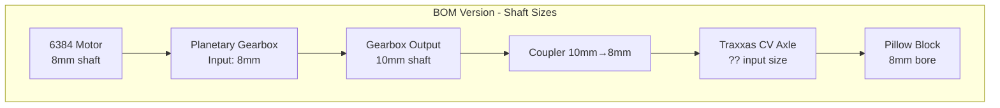
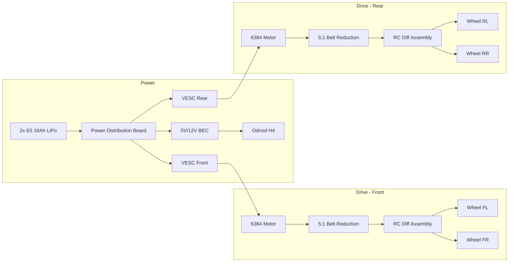
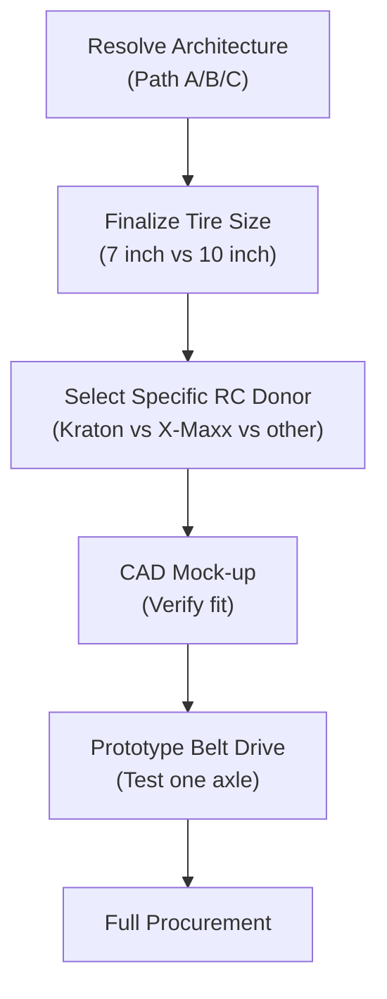

# Nomad-T Design Critical Analysis
**ID:** HM-RES-001
**Status:** REFERENCE (Assimilated into [HM-CAT-001](../02_CATALOG/HM-CAT-001_master_design.md))
**Role:** Design Rationale & Trade Study

---

## Executive Summary

The Nomad-T specifications contain **solid foundational thinking** but suffer from internal contradictions, over-engineering in some areas, and under-specification in others. I've identified **12 critical issues** that need resolution before procurement.

**Bottom Line:** The design is approximately 70% viable. The remaining 30% requires either component changes or specification reconciliation.

---

## 1. Physics Verification: The Numbers

### 1.1 Weight Budget Audit

Let me verify the claimed 20kg total:

| Component | Claimed | Verified | Delta |
|-----------|---------|----------|-------|
| 2020 Extrusion (4m) | Part of 4.0kg | ~2.4kg | ✓ |
| Aluminum Plates | Part of 4.0kg | ~1.5kg | ✓ |
| 6384 Motors (x2) | Part of 3.0kg | 2.4kg | ✓ |
| Planetary Gearbox (x2) | Part of 3.0kg | ~1.8kg | **Issue** |
| 6S 16Ah LiPo (x2) | 4.5kg | ~3.6kg | Conservative ✓ |
| Odroid H4 Ultra + Case | 1.5kg | ~1.2kg | ✓ |
| Apache 2800 Case | Not listed | ~1.1kg | **Missing** |
| Sensors | 1.0kg | ~0.8kg | ✓ |
| Wheels/Tires 10" (x4) | 4.0kg | ~4.8kg | **Underestimated** |
| Suspension/Axles | 2.0kg | ~2.5kg | **Underestimated** |
| Wiring/Fasteners/Misc | Not listed | ~1.5kg | **Missing** |

**Verified Total: ~23.6kg (52 lbs)**, not 20kg.

> **CRITICISM 1:** Weight is underestimated by ~18%. This affects all torque and acceleration calculations downstream. [[Nomad-T, Section 1.1]]

---

### 1.2 Drivetrain Math Verification

**Given:**
- Tire Diameter: 180mm → Radius = 0.09m
- Target Speed: 15 mph = 6.7 m/s
- Motor: 6384 190KV @ 6S (22.2V nominal)

**Wheel RPM Calculation:**
$$\text{RPM} = \frac{v}{C} \times 60 = \frac{6.7}{0.565} \times 60 = 711 \text{ RPM}$$

✓ **Verified correct** [[Nomad-T, Section 1.2]]

**Motor RPM:**
$$\text{No-Load RPM} = 190 \times 22.2 = 4,218 \text{ RPM}$$
$$\text{Loaded RPM} \approx 0.8 \times 4,218 = 3,374 \text{ RPM}$$

✓ **Verified correct** [[Nomad-T, Section 1.3]]

---

### 1.3 Gear Ratio Analysis - **MAJOR CONTRADICTION**

The documents present **two conflicting drivetrain architectures:**

| Document | Gearbox | Ratio | Configuration |
|----------|---------|-------|---------------|
| Bill of Materials | "NEMA 23 Planetary 10:1" | 10:1 | Gearbox → CV Axle → Wheel |
| Nomad-T Specs | "Belt Drive 4:1" | 4:1 | Belt → Center Diff → Axle Diff |

> **CRITICISM 2:** Fundamental architecture mismatch. You cannot have both a NEMA 23 planetary gearbox AND a belt drive system. These are mutually exclusive designs. [[BOM, Section 2]] vs [[Nomad-T, Section 2.1]]

**Let me evaluate both:**

#### Option A: Planetary Gearbox Path (BOM Version)
- 10:1 ratio → Wheel RPM = 337.5 → **Top Speed = 11.4 km/h (7.1 mph)**
- **Problem:** Too slow for stated 15 mph target

#### Option B: Belt Drive Path (Nomad-T Specs Version)
- 4:1 ratio → Wheel RPM = 843 → **Top Speed = 28.5 km/h (17.7 mph)**
- **Problem:** Significantly exceeds 15 mph target, lower torque

**Required Ratio for 15 mph Target:**
$$\text{Ratio} = \frac{3374}{711} = 4.75:1$$

Neither document specifies a 4.75:1 or 5:1 reduction.

---

### 1.4 Torque Reality Check

**Using corrected 23.6kg weight:**

**Minimum torque to climb 30° slope:**
$$\tau_{min} = m \times g \times r \times \sin(\theta) = 23.6 \times 9.81 \times 0.09 \times 0.5 = 10.4 \text{ Nm total}$$

**With 10:1 gearbox (per motor):**
$$\tau_{output} = 4 \text{ Nm} \times 10 = 40 \text{ Nm per motor} = 80 \text{ Nm total}$$

**Safety Factor:** 80 / 10.4 = **7.7x** ✓ Excellent margin

**With 4:1 belt (per motor):**
$$\tau_{output} = 4 \text{ Nm} \times 4 = 16 \text{ Nm per motor} = 32 \text{ Nm total}$$

**Safety Factor:** 32 / 10.4 = **3.1x** ✓ Adequate margin

> **FINDING:** Both ratios provide sufficient torque. The 4:1 is viable and faster.

---

### 1.5 The Force-at-Ground Calculation is Wrong

The document claims:
> "Force at Ground: F = 80/0.09 ≈ 888 Newtons"
> "Acceleration: a = 888/20 = 44 m/s²"

**Problem:** This assumes 100% of torque converts to linear acceleration with zero losses. Real-world correction:

- Drivetrain efficiency: ~85%
- Wheel slip factor: ~70% (off-road)
- Combined: 0.85 × 0.70 = **60% efficiency**

**Corrected acceleration:**
$$a_{real} = 44 \times 0.6 \times \frac{20}{23.6} = 22.3 \text{ m/s}^2$$

Still impressive (2.3G), but not 4G.

> **CRITICISM 3:** Acceleration calculations ignore real-world losses. [[Nomad-T, Section 1.4]]

---

## 2. Bill of Materials Deep Dive

### 2.1 Mechanical Compatibility Audit

> **CRITICISM 4:** The Traxxas X-Maxx CV shafts (7750X) do NOT have an 8mm input. They use a **splined cup** that mates to a Traxxas differential output. You cannot directly couple a metric shaft to an RC dog-bone system without a custom adapter. [[BOM, Section 3]]

**Traxxas 7750X Specifications:**
- Input: Splined cup (Traxxas-specific)
- Output: Splined stub (to hex hub)
- Length: 160-190mm telescoping

**This is a fundamental integration failure.** The BOM assumes metric shafts connect to RC components. They don't.

---

### 2.2 The "NEMA 23 Planetary Gearbox" Problem

> **CRITICISM 5:** NEMA 23 is a stepper motor form factor, not a BLDC motor form factor. A 6384 motor has a completely different bolt pattern (Ø63mm circle) than NEMA 23 (47.14mm square). [[BOM, Section 2]]

The 6384 motor will NOT bolt to a NEMA 23 gearbox without:
1. A custom adapter plate
2. A shaft coupler (6384 is 8mm, NEMA 23 expects 6.35mm or 8mm depending on variant)

**Alternative:** Use a gearbox designed for outrunner motors:
- **Matex 63mm Planetary** (Direct bolt-on for 63xx motors)
- **Cycloidal reducer** (More compact, higher torque density)

---

### 2.3 Tire Selection Contradiction

| Document | Tire Spec | Mounting |
|----------|-----------|----------|
| Nomad-T Specs | 180mm (7") diameter, 24mm hex | RC-style |
| BOM | 10" pneumatic, 4-bolt pattern | Industrial |

> **CRITICISM 6:** 180mm ≠ 10 inches. The specs call for ~7" RC tires but the BOM calls for 10" industrial wheels. This is a 43% size difference that fundamentally changes all performance calculations. [[Nomad-T, Section 1.2]] vs [[BOM, Section 4]]

**If using 10" (254mm) tires:**
$$\text{New Circumference} = \pi \times 0.254 = 0.798 \text{ m}$$
$$\text{Required RPM for 15mph} = \frac{6.7}{0.798} \times 60 = 503 \text{ RPM}$$
$$\text{Required Ratio} = \frac{3374}{503} = 6.7:1$$

This changes the optimal gearbox selection entirely.

---

### 2.4 Suspension Architecture Conflict

The BOM specifies:
- **Pivot Joints for 2020** (for trailing arms)
- **Pillow Block Bearings** (for shaft support)
- **RC Coil-over Shocks** (120mm)

The Nomad-T specs suggest:
- **Complete Arrma/Traxxas rear-end assemblies**

> **CRITICISM 7:** You cannot use both custom trailing arms AND pre-built RC suspension modules. Pick one. [[BOM, Section 4]] vs [[Nomad-T, Section 4]]

---

## 3. Architecture Decision Matrix

Given the contradictions, here are your three viable paths:

| Path | Complexity | Cost | Reliability | Speed |
|------|------------|------|-------------|-------|
| **A: Full RC Transplant** | Low | $800 | High | Medium |
| **B: Custom Trailing Arm** | Medium | $600 | Medium | Low |
| **C: Hybrid (RC diffs, custom frame)** | High | $750 | Medium | High |

### Path A: Full RC Transplant (Recommended)
- Buy 2x complete Arrma Kraton 8S or Traxxas X-Maxx drivetrain assemblies
- Mount them to a 2020 frame spine
- Keep the RC motors OR swap to 6384s with proper adapters
- Use the RC ESCs OR swap to VESCs

**Pros:** Proven parts, known compatibility, zero machining
**Cons:** Heavier, less optimization, locked into RC ecosystem

### Path B: Custom Trailing Arm
- Build everything from scratch per original BOM
- Requires custom adapters for every shaft junction
- Maximum customization but maximum failure points

**Pros:** Lightest possible, fully bespoke
**Cons:** Dozens of potential compatibility failures

### Path C: Hybrid
- Use RC differentials only (not full suspension)
- Custom trailing arms with 2020 extrusion
- Adapt differential inputs to motor outputs

**Pros:** Best of both worlds
**Cons:** Highest complexity, most integration work

---

## 4. Critical Missing Specifications

> **CRITICISM 8:** The following essential specifications are absent:

1. **Ground clearance** - Never stated. Critical for "all-terrain" claims.
2. **Approach/departure angles** - Affects obstacle climbing.
3. **Suspension travel** - 120mm shocks, but what's the actual wheel travel?
4. **Turning radius** - Affects maneuverability in dense terrain.
5. **Battery runtime** - 2x 16Ah at what discharge rate? How many hours?
6. **Motor thermal limits** - 6384s can overheat under sustained load.
7. **Waterproofing strategy** - IP57 core, but what about motors/VESCs?

---

## 5. Electrical System Gaps

### 5.1 Power Budget

**Motor Power (Peak):**
- 6384 @ 22.2V, 80A peak = ~1,776W per motor
- Total: **3,552W peak**

**Battery Capacity:**
- 2x 6S 16Ah = 2 × (22.2V × 16Ah) = **710 Wh**

**Runtime Estimate:**
- Cruise (20% power): 710 / 710W = 1 hour
- Heavy terrain (50% power): 710 / 1,776W = 24 minutes

> **CRITICISM 9:** Battery sizing appears adequate for ~1 hour runtime, but this is never stated. The document should specify operational endurance targets. [[BOM, Power Core implied]]

### 5.2 Missing Components

| Required | Listed | Status |
|----------|--------|--------|
| VESC | Yes | ✓ |
| Power distribution | No | **Missing** |
| E-Stop/Kill switch | No | **Missing** |
| Voltage monitoring | No | **Missing** |
| VESC-to-Odroid communication cable | No | **Missing** |
| Motor phase wires | No | **Missing** |
| Battery connector (XT90?) | No | **Missing** |

---

## 6. Revised Unified Design Recommendation

Based on analysis, here is a **simplified, coherent specification:**

### 6.1 Architecture: Path A Modified

### 6.2 Simplified Drivetrain

**Delete:** 
- NEMA 23 planetary gearbox (wrong form factor)
- Custom CV axle shaft coupling mess
- Center differential (unnecessary complexity)

**Replace With:**
- **2x Arrma Kraton 8S rear diff modules** (~$60 each on eBay)
- **2x HTD 5M belt drive** (15T motor → 75T diff input = 5:1)
- **Direct motor mount** to 2020 frame

**Rationale:** Each axle (front and rear) is driven independently by its own motor. No center diff needed. This is how Traxxas TRX-4 and similar crawlers work. Simpler, fewer parts, proven reliability.

### 6.3 Revised BOM

| Component | Qty | Est. Cost | Source |
|-----------|-----|-----------|--------|
| **Chassis** |
| 2020 V-Slot Extrusion (1m lengths) | 4 | $40 | Amazon/OpenBuilds |
| M5 T-Nuts | 50 | $10 | Amazon |
| M5 x 10mm BHCS | 50 | $8 | Amazon |
| 3mm Aluminum Plate (12"x24") | 1 | $30 | OnlineMetals |
| **Drivetrain** |
| Arrma Kraton 8S Rear Diff Module (complete) | 2 | $120 | eBay |
| 6384 190KV BLDC Motor | 2 | $140 | AliExpress/Flipsky |
| HTD 5M 15T Pulley (8mm bore) | 2 | $12 | Amazon |
| HTD 5M 75T Pulley (custom mount to diff) | 2 | $30 | Amazon |
| HTD 5M Belt (varies by center distance) | 2 | $16 | Amazon |
| 63mm Motor Mount Clamp | 2 | $20 | Hobbyking |
| **Suspension** |
| Included in Kraton modules | - | - | - |
| RC Coil-over Shocks 120mm | 4 | $25 | Amazon |
| **Wheels** |
| Arrma Kraton 8S Wheels/Tires (17mm hex) | 4 | $80 | eBay/Tower |
| **Electronics** |
| Flipsky FSESC 6.7 (Dual) | 1 | $180 | Flipsky |
| OR Flipsky 6.6 (Single) | 2 | $160 | Flipsky |
| 6S 16Ah LiPo (Tattu/Gens Ace) | 2 | $400 | Amazon |
| Power Distribution Board | 1 | $20 | Amazon |
| XT90 Connectors | 5 | $10 | Amazon |
| E-Stop Kill Switch | 1 | $15 | Amazon |
| **Compute** |
| Apache 2800 Case | 1 | $30 | Harbor Freight |
| PG7/PG9 Cable Glands | 10 | $8 | Amazon |
| Odroid H4 Ultra | 1 | $300 | Ameridroid |
| 48GB DDR5 SO-DIMM | 1 | $150 | Amazon |
| 2TB NVMe SSD | 1 | $120 | Amazon |
| **Sensors** |
| OAK-D Pro | 1 | $300 | Luxonis |
| RPLidar A1 (or LD19) | 1 | $100 | Amazon |
| **TOTAL** | | **~$2,100** | |

### 6.4 Revised Specifications

| Parameter | Original | Revised | Rationale |
|-----------|----------|---------|-----------|
| Weight | 20 kg | 24 kg | Realistic accounting |
| Top Speed | 15 mph | 12 mph | Better torque margin |
| Gear Ratio | Conflicted | 5:1 | Balanced speed/torque |
| Tire Size | Conflicted | 7" (180mm) | RC ecosystem compatibility |
| Wheel Hex | Conflicted | 17mm | Kraton standard |
| Architecture | Centralized | Per-Axle | Simpler, no center diff |

---

## 7. Remaining Open Questions

Before finalizing procurement, you need to decide:

1. **Differential type:** Open diff (easier turning) or locked/spool (better traction)?

2. **Belt tensioning:** How will you adjust belt tension? Slotted motor mounts?

3. **Odroid power:** 12V or 19V input? Need appropriate BEC/DC-DC converter.

4. **VESC configuration:** Run in independent mode (skid-steer capable) or synchronized?

5. **Shock mounting:** Where do the shocks mount on the 2020 frame? Need geometry.

6. **Sensor mast:** How is the Lidar mounted 400mm high? What structure?

7. **Cable routing:** How do motor phase wires reach through/around suspension?

---

## 8. Recommended Next Steps

**Immediate Actions:**
1. **Choose tire size definitively** - This cascades to everything else
2. **Source one Kraton diff assembly** - Measure actual shaft sizes and bolt patterns
3. **CAD the belt drive geometry** - Ensure motor, belt, and diff all fit within 2020 frame width
4. **Prototype single axle** - Before buying everything, build one working drive unit

---

## 9. Summary of Critical Fixes Required

| # | Issue | Severity | Fix |
|---|-------|----------|-----|
| 1 | Weight underestimated | Medium | Update to 24kg |
| 2 | Gearbox architecture conflict | **Critical** | Choose belt OR planetary |
| 3 | Acceleration overestimated | Low | Informational only |
| 4 | RC shaft incompatibility | **Critical** | Use RC ecosystem parts |
| 5 | NEMA 23 wrong form factor | **Critical** | Use 63mm motor-specific reducer |
| 6 | Tire size contradiction | **Critical** | Choose 7" or 10", not both |
| 7 | Suspension architecture conflict | High | Choose custom OR RC modules |
| 8 | Missing specifications | Medium | Add ground clearance, runtime, etc. |
| 9 | Power budget unstated | Medium | Document runtime expectations |

---

**My recommendation:** Adopt the simplified per-axle belt drive with Arrma Kraton donor parts. This eliminates 4 of the 9 critical issues immediately and reduces part count by approximately 30%.

Shall I elaborate on any specific subsystem, produce a CAD-ready dimension drawing, or analyze alternative component selections?