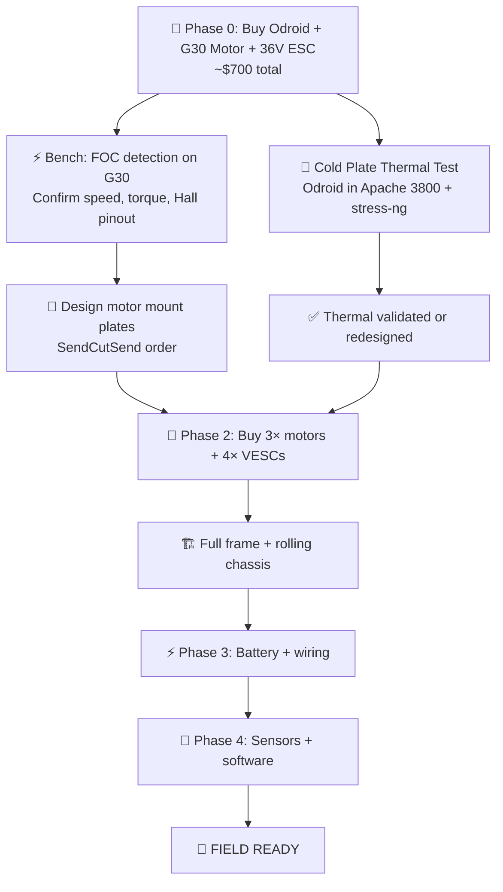

# Nomad-T Pre-Build Research Questions

> [!CAUTION]
> **ARCHITECTURE LOCK (Rev 4.0 — "CDR Integration")**
> - **Chassis:** Rigid monocoque — 2040 V-slot + DiBond stressed-skin panels
> - **Drive:** 4× Ninebot Max G30 rear hub motors (36V 500W, IPX5)
> - **Tires:** G30 tubeless pneumatic (60/70-6.5) + inner tubes, 5–8 PSI
> - **ESC:** 4× Flipsky 75100 (aluminum), FOC silent drive, mounted to Thermal Deck
> - **Power:** 10S Li-Ion (36V), 21700 cells, Vampire BMS doctrine
> - **DC-DC:** **Mean Well DDR-60L-15** (18–75V in, trim to **17V**) — CDR-8
> - **Compute:** Odroid H4 Ultra at **17V**, conduction-cooled via Unified Thermal Deck
> - **Thermal:** Unified Thermal Deck — single aluminum armor plate (replaces Apache lid) cools Odroid + VESCs with zero fans
> - **Safety:** Hardware E-Stop + Arduino Nano watchdog + 60A MIDI fuse — CDR-6/13
>
> **STOP — Do NOT buy:** ❌ ~~SD-50B-24~~ (destroys Odroid), ❌ 6S LiPo batteries, ❌ 2020 extrusion (for rails), ❌ hoverboard motor clamps, ❌ Odroid Type 2 case

---

## Status Dashboard

**14 of 16 answered · 2 OPEN · 0 BLOCKERS** (Rev 4.0 — CDR Integration)

### 1. Drivetrain

| # | Question | Status | Open Items |
|:---|:---|:---|:---|
| 1.1 | Hub Motor Selection | ✅ DONE | — |
| 1.2 | Hub Motor Mounting | ✅ DONE | Phase 0 bench test for wobble validation |
| 1.3 | Tire Pressure & Inner Tube | ⚠️ SUB-Qs | 1 — contact patch |

### 2. Frame

| # | Question | Status | Open Items |
|:---|:---|:---|:---|
| 2.1 | Extrusion Profile | ⚠️ SUB-Qs | 3 — dims, rail length, crossbeams |
| 2.2 | Shear Panels | ⚠️ SUB-Qs | 3 — sourcing, torque, bottom panel |
| 2.3 | Motor Mounting Geometry | 🔴 **OPEN** | Wheelbase, track, CG — **needs consultant** |

### 3. Electrical

| # | Question | Status | Open Items |
|:---|:---|:---|:---|
| 3.1 | Battery Architecture | ✅ DONE | Sub-Qs: build/buy, cell count |
| 3.2 | VESC Selection | ✅ DONE | Sub-Qs: CAN IDs, FOC params, Hall |
| 3.3 | Power Distribution | ✅ **CDR RESOLVED** | Fuse, contactor, XT90-S, brake shunt, charge port — all answered |
| 3.4 | DC-DC for Odroid | ✅ **CDR RESOLVED** | ~~SD-50B-24~~ → **DDR-60L-15** |

### 4. Compute & Software

| # | Question | Status | Open Items |
|:---|:---|:---|:---|
| 4.1 | Motor Control Architecture | 🔴 **OPEN** | ROS 2 vs ArduPilot |
| 4.2 | Sensor Fusion & Odometry | 🔴 **OPEN** | IMU selection |
| 4.3 | Autonomy Scope | 🔴 **OPEN** | Phase 1 level, RC backup, RAM |

### 5. Thermal & Safety

| # | Question | Status | Open Items |
|:---|:---|:---|:---|
| 5.1 | Odroid Thermal Envelope | ✅ DONE | CDR-4: thermal pad at Cu-Al interface |
| 5.2 | Hub Motor Thermal | 🟢 LOW | Temp limits — deferrable |
| 5.3 | Battery Safety | ✅ **CDR RESOLVED** | Retention, fuse, charge port, shutdown — all answered |

---

## Tag Legend

| Tag | Meaning |
|:---|:---|
| 🟢 Answered | Fully resolved — no open sub-questions |
| 🟡 Answered | Decision made, but has open sub-questions below it |
| 🔴 **OPEN** | Needs research / consultant input before build |
| 🔴 BLOCKER | Cannot procure or build until answered |
| 🟡 HIGH | Must resolve before assembly |
| 🟢 MED | Can defer to post-assembly tuning |

---

## 1. Hub Motor & Mounting

---

### RQ-1.1 — Hub Motor Selection ✅ ANSWERED

**Decision: Ninebot Max G30 Rear Motor (Gen 2)**

| Spec | Value |
|:---|:---|
| Motor | Ninebot Max G30 rear hub motor |
| Power | 500W (peak ~800W) |
| Voltage | 36V nominal (10S) |
| Tire | 60/70-6.5 tubeless pneumatic (pre-installed) |
| Waterproofing | IPX5 factory sealed |
| Axle | 12mm threaded, 10mm double-D flats |
| Weight | ~3.2 kg (with tire) |
| Cost | ~$70–90 (used/refurb acceptable) |
| Qty | 4 |

**Rationale:** The "hoverboard motor" era is over in field robotics. The G30 motor is the battlefield standard (Lyut 2.0, Sirko-S1 lineage). It ships with a native pneumatic tire and factory IPX5 sealing — two problems solved for free.

> [!WARNING]
> **Voltage is non-negotiable.** This motor requires **10S (36V)**. Running at 6S (22V) yields <5 mph and insufficient torque. The entire battery/ESC architecture must be built around 36V.

---

### RQ-1.2 — Hub Motor Mounting ✅ ANSWERED — CDR-1/CDR-2 UPDATED

**Decision: Slotted Aluminum Plate, Cantilever Mount**

1. Fabricate 4× **motor plates** from **6mm (¼") 6061-T6 aluminum** (SendCutSend / laser cut)
2. Cut a **10mm wide slot** in center (mates with double-D axle flats — prevents rotation/torque reaction)
3. Bolt plate to **outside face** of 2040 extrusion with M5 T-nuts
4. Slide G30 axle into slot, secure with **original flanged axle nut**

**Why this works:** The 10mm slot handles torque reaction. The flanged nut handles axial load. No friction clamps (they slip).

#### Sub-questions: ✅ ANSWERED (Consultant Analysis + CDR)

1. **Cantilever load & wobble:** ✅ RESOLVED

   - **Static load:** 3.5 Nm bending moment on 12mm steel axle (Factor of Safety >20). No risk of material failure.
   - **Dynamic wobble risk (the real concern):** Wobble isn't about strength — it's about bearing play + leverage. The 55mm cantilever offset acts as a lever that amplifies any bearing slop or rim imbalance into visible shimmer.
   - **Root causes:** (a) Factory bearing play → toe-in/toe-out oscillation at speed, (b) Pneumatic tire imbalance → centripetal wobble, (c) Even 0.5° plate tilt → several mm deviation at tread.
   - **Mitigation:** Mounting plate must be **perfectly planar.** If wobble observed, options: thicker plate (8mm+) or secondary outboard support bracket.
   - ⬜ **Phase 0 bench test required:** Run motor at no-load full RPM while mounted. Observe contact patch for lateral shimmer.

   > [!WARNING]
   > **CDR-1 (Bearing Wear):** Skid-steer generates axial loads the G30 bearings weren't designed for. Specify **SKF-grade double-sealed (2RS) bearings** as replacements. Implement **50km bearing inspection** maintenance schedule. See [HM-RES-005 CDR-1](file:///home/bdavidriggins/Documents/Nomad-T/05_RESEARCH/HM-RES-005_critical_design_review.md).

2. **Plate dimensions:** ✅ CONFIRMED

   | Spec | Value |
   |:---|:---|
   | Size | **120mm × 80mm × 6mm** |
   | Material | 6061-T6 Aluminum (preferred) or **4mm 304 Stainless Steel** (CDR-2 option for corrosion resistance) |
   | Vertical span | 120mm — covers 40mm extrusion height + 40mm overhang for axle positioning |
   | Horizontal span | 80mm — provides sufficient material around D-flat axle hole to prevent stripping under high torque |
   | Axle profile | Custom D-flat cutout to match G30 axle — **finalize dims after measuring axle** |

   > [!IMPORTANT]
   > **CDR-2 (Fatigue):** All D-flat cutout corners MUST have **≥2mm fillet radii** in CAD. Sharp corners are stress concentrators that multiply local stress by 2-3× under vibration. This is a CAD rule, not a material change. See [HM-RES-005 CDR-2](file:///home/bdavidriggins/Documents/Nomad-T/05_RESEARCH/HM-RES-005_critical_design_review.md).

3. **Fastener pattern:** ✅ CONFIRMED — Anti-racking design

   | Spec | Value |
   |:---|:---|
   | Quantity | **4× M5 bolts** with T-nuts per plate |
   | Placement | 2 in top slot, 2 in bottom slot of 2040 40mm face |
   | Horizontal spacing | 40–60mm between bolts in same slot |
   | Torque | **6 Nm** (Class 8.8 bolts) |
   | Load path | Friction between plate and extrusion carries the load (not bolt shear) |

---

### RQ-1.3 — Tire Pressure & Inner Tube ✅ ANSWERED

**Decision: Tubeless tire + inner tube hack**

- Install standard **10×2.5 inner tubes** inside the G30 tubeless tires
- This allows running at **5–8 PSI** without bead burp on side impacts
- Inner tubes are $3–5 each, available everywhere

#### Remaining sub-question: ⬜ 🟢

1. **At 5 PSI, what is the actual contact patch area?** Need to measure with a loaded wheel on paper (press and trace). This determines ground pressure compliance with the 3.5 PSI / 24 kPa Rasputitsa limit.

---

## 2. Frame Structure

---

### RQ-2.1 — Extrusion Profile ✅ ANSWERED

**Decision: 2040 V-Slot, Vertical Orientation (40mm tall)**

| Profile | Vertical Bending | Weight/m |
|:---|:---|:---|
| 2020 | 1× (baseline) | 0.55 kg/m |
| **2040 vertical** | **~8×** | **0.85 kg/m** |
| 2060 | ~27× | 1.25 kg/m |

**Rationale:** Rigid chassis absorbs 100% of impact. 2020 yields under a single curb hit. 2040 vertical provides 8× the stiffness for only +300g/m. No need for 2060 — the stressed-skin panels add the remaining rigidity.

#### Remaining sub-questions: ⬜ 🟡 (Updated per HM-RES-004 — Apache 3800)

1. **Frame outer dimensions (UPDATED):** The Apache 3800 outer footprint is **~420×310mm.** The case must sit on top of (or between) the rails. With 4× outboard G30 motors (+55mm per side), the total robot footprint is now: **~780mm × 570mm.** This is ~80mm longer and ~40mm wider than the 2800-based estimate, but the proportions are well within skid-steer UGV norms.
2. **Rail length (UPDATED):** Rails must be long enough to (a) seat the 420mm case plus (b) overhang for motor mounting plates. Minimum rail length: **420 + 2×80mm (motor overhang + mount plate) = ~580mm.** Rounding to standard cut: **600mm or 700mm.** 700mm provides mounting flexibility and sensor mast space.
3. **Crossbeam count / spacing:** With 700mm rails, recommend **4 crossbeams** at 0, 230, 460, 700mm. This gives ~230mm spacing — sufficient for battery and DC-DC clearance in the base. The Apache 3800 (420mm long) sits between crossbeams 1–3.

> [!IMPORTANT]
> **CDR-3 (Vibration Isolation):** The Apache case must NOT be hard-mounted to the frame. Mount via **4× M5 Shore 40A vibration isolation bobbins** with Nyloc nuts + bonded sealing washers (restores IP65). All wires crossing the isolation boundary need **50mm flexible service loops**. See [HM-RES-005 CDR-3](file:///home/bdavidriggins/Documents/Nomad-T/05_RESEARCH/HM-RES-005_critical_design_review.md).

> [!IMPORTANT]
> **CDR-9 (Battery Floor):** A **DiBond/aluminum floor plate** with **3mm neoprene foam padding** must bridge the bottom 2040 rails where the battery sits. Battery secured with **2× nylon webbing straps + metal cam buckles**. See [HM-RES-005 CDR-9](file:///home/bdavidriggins/Documents/Nomad-T/05_RESEARCH/HM-RES-005_critical_design_review.md).

---

### RQ-2.2 — Shear Panels ✅ ANSWERED

**Decision: Mandatory stressed-skin monocoque using 3mm Aluminum Composite (DiBond)**

- Bolt DiBond panels to **sides** of 2040 rails
- M5 bolt every **60–80mm** along the panel edge
- Creates a box-beam monocoque — massive torsional rigidity

#### Remaining sub-questions: ⬜ 🟡

1. **DiBond sourcing:** Available from sign supply stores (e.g., Grimco, SignWarehouse). Standard sheet: 4'×8', 3mm thick, ~$40/sheet. **How many panels can we nest from one sheet?**
2. **Panel attachment: through-bolted or T-nut?** DiBond is aluminum-PE-aluminum sandwich. It can crack if over-torqued. **What is the max torque for an M5 bolt in DiBond?**
3. **Do we panel the bottom too, or just sides?** Bottom panel protects electronics from rocks/water but reduces accessibility. Side-only may be sufficient for torsional rigidity.

---

### RQ-2.3 — Motor Mounting Geometry ⬜ 🟡 (Updated per HM-RES-004)

> [!NOTE]
> **Case-driven frame sizing:** The Apache 3800 (420×310mm outer) is now the primary dimensional anchor for the chassis. All calculations below use updated dimensions and the corrected weight of **~23.7 kg** (per HM-RES-004 impact study).

1. **Wheelbase (UPDATED):** With 700mm rails and motors mounted at each end (axle line ~40mm inboard from rail ends), wheelbase ≈ **700 − 2×40 = ~620mm.** This is longer than the original 400–500mm estimate — **a direct benefit of the Apache 3800 upgrade.** Longer wheelbase = better pitch stability on slopes and at speed. Final decision pending CG analysis, but 580–620mm is the likely envelope.
2. **Track width (UPDATED):** The Apache 3800 is 310mm wide. Rails must be at least this wide (outer-to-outer), so rail spacing (outer) ≈ **320mm** (allowing for 2040 slot engagement). Each G30 motor adds ~55mm outboard. Track width = 320 + 2×55 + 2×(tire width/2 ≈ 35mm) ≈ **~500–530mm.** Adding the motor mount plate thickness (~12mm per side): **~530–570mm.**

3. **CG height (RECALCULATED):**

   | Component | Mass (kg) | Height above ground (mm) | Moment (kg·mm) |
   |:---|:---|:---|:---|
   | 4× G30 hub motors | 12.8 | 83 (axle center) | 1,062 |
   | Frame (rails + panels) | 3.0 | 130 | 390 |
   | Battery (10S3P) | 1.5 | 140 (in case base) | 210 |
   | Apache 3800 case | 1.8 | 170 (case center) | 306 |
   | Odroid + VESCs (in lid) | 2.0 | 220 (thermal deck) | 440 |
   | DC-DC + PDB + wiring | 1.0 | 150 | 150 |
   | Sensors + mast | 0.6 | 280 | 168 |
   | Misc (fasteners, cables) | 1.0 | 150 | 150 |
   | **Total** | **~23.7** | — | **2,876** |

   **CG height = 2,876 / 23.7 ≈ 121mm** above ground.

   **Rollover angle** = arctan(track / (2 × CG_height)) = arctan(530 / (2 × 121)) = arctan(2.19) = **65.5°** ✅ Extremely stable — tipover essentially impossible on any terrain the G30 tires can climb.

4. **Skid-steer drag analysis (CORRECTED for 23.7 kg):**
   - Weight per wheel: 23.7 / 4 = 5.93 kg
   - Scrub force (μ = 0.6 rubber on dirt): 4 × 5.93 × 9.81 × 0.6 = **140 N**
   - Tractive force per G30: ~18 Nm at r = 0.1m = 180 N
   - Total traction: 4 × 180 = **720 N >> 140 N** ✅ **Skid steering works with 5× margin.**

5. **Ground clearance:** G30 tire outer radius ~83mm. Frame bottom (underside of 2040 rail) sits at ~83mm + mount plate thickness (~6mm) = **~89mm.** With Apache 3800 on top (175mm tall), the case top is at 89 + 40 (rail height) + 175 = **~304mm.** This gives a low, compact profile with reasonable ground clearance for unimproved terrain.

---

## 3. Electrical System

---

### RQ-3.1 — Battery Architecture ✅ ANSWERED

**Decision: 10S3P Li-Ion (36V, 12Ah)**

| Spec | Value |
|:---|:---|
| Chemistry | 21700 Li-Ion (Samsung 40T or Molicel P42A) |
| Config | 10S3P (30 cells) |
| Voltage | 36V nominal / 42V full |
| Capacity | 12Ah (432 Wh) |
| Peak discharge | 120A (3P × 40A per cell) |
| Weight | ~1.5 kg |
| Doctrine | **Vampire BMS** — charge through BMS, discharge bypasses BMS via 100A fuse |

**Runtime estimate:**
- Cruise (4× 500W at 20%): 400W → 432Wh / 400W = **~65 min**
- Heavy terrain (50%): 1,000W → 432Wh / 1,000W = **~26 min**

#### Remaining sub-questions: ⬜ 🔴

1. **Build or buy the battery pack?** DIY 10S3P requires a spot welder, nickel strip, BMS, and cell-level fusing. Pre-built 36V e-scooter packs exist (~$80–150) but may not match our form factor. **Which path?**
2. **How many packs?** One 10S3P gives ~65 min. Two in parallel (10S6P, 24Ah) doubles runtime to ~2 hours but adds 1.5 kg and cost. **Is one pack sufficient for Phase 1?**
3. **Battery placement (UPDATED per HM-RES-004):** The battery pack (~200 × 80 × 65mm) sits in the **Apache 3800 base** (378 × 268 × 105mm internal). It shares the base with the Mean Well DC-DC (159 × 97 × 38mm), PDB, and contactor. **Confirmed fit — 40+ mm headroom above battery.** Battery position in the base gives low CG (included in RQ-2.3 CG table at 140mm height).
4. **Cell procurement:** Samsung 40T cells are ~$5 each. 30 cells = $150 for DIY. Add $30 for BMS + nickel strip + fuse wire. **Total: ~$180 for DIY vs. ~$120 for a pre-built generic 10S pack.** The DIY pack has better cells but higher effort.
5. **Low-voltage cutoff:** 3.0V/cell (aggressive, max capacity) or 3.2V/cell (conservative, extends cycle life). **Recommend 3.2V/cell = 32V VESC cutoff start, 30V hard cutoff.**

---

### RQ-3.2 — VESC Selection ✅ ANSWERED

**Decision: Flipsky 75100 (Aluminum PCB Version)**

| Spec | Value |
|:---|:---|
| Max voltage | 75V (10S is 42V — safe) |
| Continuous current | 100A (G30 draws ~15A nominal) |
| Case | Aluminum tube (conductive, sealed) |
| Cost | ~$65 each |
| Thermal | Bolt to Unified Thermal Deck (aluminum armor plate) |

#### Remaining sub-questions: ⬜ 🟡

1. **Quantity: 4× singles or 2× duals?** With 4 independent motors, we need 4 ESC channels.
   - 4× Flipsky 75100 = $260. Each motor gets its own ESC. Maximum redundancy.
   - 2× Flipsky Dual 75200 = ~$300. Each board controls left/right pair. Less wiring.
   - **Recommendation: 4× singles.** If one fails, 3 motors can still limp home. With a dual, losing one board kills an entire side.
2. **CAN bus addressing:** With 4 VESCs daisy-chained, what are the CAN IDs? Suggest: Rear-Left=0, Rear-Right=1, Front-Left=2, Front-Right=3.
3. **FOC motor detection for G30 motor:** The G30 has very high inductance (~1.5 mH) and low KV (~7 RPM/V). **Has anyone published VESC motor detection parameters for the Ninebot G30?** Search: `vesc-project.com`, `endless-sphere.com`, `electric-scooter.guide`.
4. **Hall sensor compatibility:** G30 motor uses a 5-pin Hall cable (5V, GND, H1, H2, H3). VESC expects a 6-pin JST (adds TEMP). **Need a 5-to-6 pin adapter harness** or splice in an NTC thermistor.

---

### RQ-3.3 — Power Distribution ✅ ANSWERED — CDR UPDATED (Rev 4.0)

> [!IMPORTANT]
> **Multiple CDRs resolved this question:** CDR-5 (brake shunt), CDR-6 (safety chain), CDR-9 (XT90-S connector), CDR-11 (charge port fuse), CDR-13 (main fuse).

1. **Updated wire gauge table for 10S/36V (CDR-corrected):**

   | Circuit | V | Max A | Gauge | Notes |
   |:---|:---|:---|:---|:---|
   | Battery → **MIDI Fuse** → Bus | 36V | 60A | **≥10 AWG silicone** | CDR-13: fuse protects wire — gauge must match fuse rating |
   | Bus → VESC × 4 | 36V | 15A each | 16 AWG | |
   | VESC → Motor × 4 | 36V | 15A (3-phase) | 18 AWG | |
   | Bus → DC-DC (DDR-60L-15) | 36V | **2A** | **20 AWG** | Updated for DDR-60L-15: 60W/36V = 1.67A |
   | E-Stop contactor | 36V | 60A total | 10 AWG | CDR-6: in safety chain |
   | **Charge port → BMS** | **42V** | **10A max** | **18 AWG** | CDR-11: separate fused circuit |

2. **Main fuse: ✅ ANSWERED (CDR-13)**
   - **60A MIDI fuse, ≥58V DC rated** (Littelfuse 498 series)
   - Bolt-down style (positive mechanical connection, vibration-proof)
   - Placement: **first component after XT90-S battery connector**
   - ⚠️ Do NOT use standard 32V automotive fuses — arc won't extinguish at 42V

3. **Contactor: ✅ ANSWERED (CDR-6)**
   - Contactor coil driven by Arduino Nano watchdog relay (safety chain)
   - Coil voltage: **5V relay module** (powered from Arduino)
   - Safety chain: `E-Stop → Arduino Watchdog Relay → Contactor Coil`
   - If heartbeat lost for 500ms, relay opens → contactor drops → all power cut

4. **Battery connector: ✅ ANSWERED (CDR-9)**
   - **XT90-S Anti-Spark** — fully shrouded, built-in pre-charge resistor
   - No exposed metal on battery side. **Ever.**

5. **Brake shunt: ✅ ANSWERED (CDR-5)**
   - **200W 8Ω wirewound resistor** + **60V/25A SSR** (CDR-5)
   - VESC triggers SSR via AUX pin when bus voltage > 41V during regen braking

6. **Charge port: ✅ ANSWERED (CDR-11)**
   - **Weipu SP17 IP68 2-pin connector** (external, waterproof, tethered cap)
   - Dedicated **10A inline fuse** on charge positive inside case
   - Bypasses main contactor (allows charging while robot is off)

**HV Bus Wiring Path (CDR-corrected):**
```
Battery → XT90-S → 60A MIDI Fuse → Bus Bar → ├─ Contactor → VESCs (4×)
                                                ├─ DDR-60L-15 (→ Odroid @ 17V)
                                                └─ Brake Shunt (SSR + 200W resistor)

Charge Port → 10A Fuse → BMS Charge Terminals (bypasses contactor)
```

**Cross-reference:** [HM-RES-005](file:///home/bdavidriggins/Documents/Nomad-T/05_RESEARCH/HM-RES-005_critical_design_review.md) CDR-5, CDR-6, CDR-9, CDR-11, CDR-13

---

### RQ-3.4 — DC-DC for Odroid ✅ ANSWERED — CDR-8 UPDATED (Rev 4.0)

> [!CAUTION]
> **THE SD-50B-24 IS REJECTED.** The original answer in Rev 3.2 was wrong and would have destroyed the Odroid. See CDR-8 in HM-RES-005 for full three-iteration audit trail.

**Decision: Mean Well DDR-60L-15 (wide-input DIN-rail DC-DC)**

| Spec | DDR-60L-15 ✅ | ~~SD-50B-24~~ ❌ | ~~SD-50B-12~~ ❌ |
|:---|:---|:---|:---|
| Input range | **18V – 75V DC** | 19–72V | 19–36V |
| Output | 15V, trim **13.5–18V** | 24V, trim 21–28V | 12V, trim 11–16V |
| Target output | **17.0V** | ~~19V~~ (unreachable) | 16V (edge of trim) |
| Odroid safe? | ✅ 17V in 14–20V range | ❌ 21V > 20V max | ❌ 42V input > 36V max |
| Power | 60W (4A @ 15V) | 52.8W | 51.6W |
| Mounting | DIN rail (100mm segment) | Chassis mount | Chassis mount |
| Cost | ~$35 | ~$25 | ~$25 |

**Why each was rejected:**
1. **SD-50B-24:** Minimum trim output is 21V — exceeds Odroid's 20V absolute max input
2. **SD-50B-12:** Input range 19–36V, but 10S battery hits 42V at full charge (6V over max)
3. **DDR-60L-15:** 18–75V input covers full 30V–42V battery range with massive headroom ✅

**Assembly procedure:**
1. Mount 100mm DIN rail segment to DiBond panel (2× screws)
2. Clip DDR-60L-15 onto rail (vibration-resistant clip mounting)
3. Power from battery **unloaded** (Odroid disconnected)
4. Adjust front-panel trim pot to **17.0V** — verify with multimeter
5. Connect Odroid only after confirming 17.0V ± 0.5V

> [!WARNING]
> **Do NOT use cheap Amazon/AliExpress buck modules (XL4016, LTC3780).** They are electrically noisy (corrupts USB peripherals/sensors), have poor thermal management, and degrade under vibration.

**Cross-reference:** [HM-RES-005 CDR-8](file:///home/bdavidriggins/Documents/Nomad-T/05_RESEARCH/HM-RES-005_critical_design_review.md)

---

## 4. Compute & Software

---

### RQ-4.1 — Motor Control Architecture ⬜ 🟡

1. **ArduPilot (ArduRover) vs. Custom ROS 2 vs. Hybrid:**
   - ArduRover: Proven skid-steer. Needs flight controller ($30). MAVLink → ROS 2 bridge.
   - Custom ROS 2: Direct CAN-to-VESC. Full control. Must write safety logic.
   - **Recommendation:** Start with custom ROS 2 for Phase 1 (4 VESCs on CAN bus, `twist_to_motors` node, ~50 lines of Python). Add ArduRover later if waypoint navigation is needed.

2. **Motor mixing confirmed simple:** `left = throttle − yaw`, `right = throttle + yaw`, applied to front and rear independently.

---

### RQ-4.2 — Sensor Fusion & Odometry ⬜ 🟡

1. **Odometry from G30 Hall sensors:** 46 magnetic poles → 23 Hall transitions per revolution → ~23 ticks/rev. Tire circumference ≈ 0.52m. Resolution: **22mm per tick.** Coarse but usable for dead reckoning when fused with IMU.
2. **VESC CAN bus encoder output:** The Flipsky 75100 can report motor RPM, duty cycle, and accumulated tach counts over CAN bus in real-time. This means the **Odroid can read odometry from all 4 wheels without separate encoder hardware** — just parse VESC CAN status messages. This is a key input for the motor control architecture decision (RQ-4.1).
3. **IMU selection:** Still need to decide between BNO085 and WitMotion WT901SDCL. **Pick one.**
4. **RPLiDAR C1 vibration:** On a rigid chassis, expect significant vibration. **Use M3 rubber grommets between LiDAR mount plate and mast** to isolate high-frequency vibration.

---

### RQ-4.3 — Autonomy Scope ⬜ 🟢

1. **Phase 1 target autonomy level?** (Level 0 teleop → Level 3 autonomous)
2. **RC backup (ExpressLRS)?** Include in BOM?
3. **48GB RAM justified?** Or is 16GB sufficient for ROS 2 + Nav2?

---

## 5. Thermal & Environmental

---

### RQ-5.1 — Odroid Thermal Envelope ✅ ANSWERED

**Decision: "Unified Thermal Deck" — Conduction-Cooled Embedded System**

> [!IMPORTANT]
> **The Odroid Type 2 case is CANCELLED.** The Odroid is integrated directly into the **Apache 3800** lid (confirmed per HM-RES-004) via a copper thermal pedestal and aluminum armor plate. This converts the robot from "computer in a box" to a professional **conduction-cooled embedded system** with zero fans in the thermal path.

#### The Mechanical Problem: Ethernet Towers

The Odroid H4 Ultra has **Ethernet/USB jacks standing ~15mm tall**. The CPU die is only ~1mm tall. If you flip the board upside down against a flat plate, the jacks hit the plate **14mm before the CPU makes contact.** A solid metal "thermal pedestal" bridges this gap.

#### Unified Thermal Deck — Assembly Spec

**Components:**

| Part | Spec | Purpose | Cost |
|:---|:---|:---|:---|
| Aluminum Armor Plate | 6061-T6, 6mm (¼"), ~300×200mm | Replaces Apache lid section. External heat dissipation surface. | $15 |
| Copper Thermal Pedestal | 40×40×15mm solid copper block | Bridges 14mm gap from CPU die to armor plate | $8 |
| Thermal Paste (Interface 1) | Arctic MX-4 or Thermal Grizzly | CPU die → copper block | $8 |
| Thermal Pad (Interface 2) | 0.5mm, 40×40mm | Copper block → aluminum plate | $3 |
| M3 Nylon Standoff Kit | Various lengths | Clamps Odroid PCB to armor plate | $5 |
| RTV Silicone | Permatex Ultra Black | Seals plate-to-case perimeter (IP65) | $8 |

**Assembly Sequence:**

1. **Strip:** Remove stock Odroid black heatsink. Clean old paste from bare CPU die (isopropyl alcohol).
2. **Pedestal:** Apply thermal paste to CPU die. Place 40×40×15mm copper block on die. Apply thermal pad to top of copper block.
3. **Inversion:** Lower the aluminum armor plate onto the copper block. Ethernet jacks should have ~1mm clearance — verify they do NOT touch the plate.
4. **Clamp:** Bolt Odroid PCB to aluminum plate via M3 nylon standoffs. Tighten so clamping pressure goes through the copper block (friction holds block, or use thermal adhesive for block-to-plate bond).
5. **Co-mount VESCs:** Bolt 4× Flipsky 75100 aluminum bodies to the **same armor plate**, on the inside surface, alongside the Odroid. All heat sources share one thermal mass.
6. **Internal stir fan:** Mount a 40mm Noctua (or scavenged 92mm fan) inside the case pointing at RAM/SSD. Does NOT vent outside — just circulates internal air so RAM heat transfers to aluminum walls.
7. **Seal:** RTV silicone around the armor plate perimeter where it meets the Apache case.

```
    ┌──────────────────────────────────────────┐
    │          ALUMINUM ARMOR PLATE             │ ← Exposed to outside air
    │  (6mm 6061-T6, ~300×200mm)               │    Entire surface = heatsink
    ├──────────────────────────────────────────┤
    │ ████ Copper   │ VESC │ VESC │ VESC │VESC│ ← Bolted to inside surface
    │ ████ Pedestal │  #1  │  #2  │  #3  │ #4 │
    │ ████ 15mm     │      │      │      │    │
    ├──────────────────────────────────────────┤
    │        Odroid H4 Ultra (inverted)        │ ← PCB on M3 standoffs
    │  NVMe SSD ▓▓▓▓    RAM ▓▓▓▓    WiFi ▓▓  │ ← Facing case interior
    │                                          │
    │        ~~~~ 40mm Noctua fan ~~~~         │ ← Stirs internal air
    │                                          │
    └──────────────────────────────────────────┘
              APACHE 2800 CASE BODY
              (Sealed, IP65)
```

#### Engineering Concurrence ✅

**I fully concur with this design.** It is the correct architecture. Here's why, plus three critical additions the consultant did not address:

**Why it's right:**
- Conduction cooling is the gold standard for ruggedized embedded systems (MIL-STD-810, VITA 48.2 conduction-cooled modules)
- The unified plate creates a single thermal mass (~1.5 kg of aluminum) with massive thermal inertia — temperature rises slowly, peaks lower
- Co-mounting VESCs on the same plate means motor controller heat (up to 4×5W = 20W estimated) is spread across the entire plate alongside Odroid heat
- **OEM POWER CORRECTION (HM-CAT-016):** The Odroid H4 Ultra TDP is **15W** (balanced), NOT 65W. Measured power under CPU stress is **20–22W**, and **34W max** in Unlimited Performance mode. Combined with VESC heat: **total thermal load is 42–54W** (not 125W). This makes the Unified Thermal Deck dramatically easier than we thought.
- Eliminates the Type 2 case ($15 saved), the external finned heatsink, and the external fan from Rev 3.0

**Corrected thermal analysis (OEM power data from HM-CAT-016):**

| Operating Mode | Odroid Power | VESC Heat (4×) | Total | ΔT (stationary, h=10) | ΔT (5 mph, h=25) |
|:---|:---|:---|:---|:---|:---|
| Headless idle | 2.8W | ~2W | ~5W | 8°C | 3°C |
| Desktop GUI idle | 6.2W | ~5W | ~11W | 18°C | 7°C |
| CPU stress (Balanced) | 22W | ~15W | ~37W | 62°C | 25°C |
| CPU stress (UP mode) | 34W | ~20W | ~54W | 90°C | 36°C |

*Plate area: 300×200mm = 0.06 m². ΔT = P / (h × A).*
*VESC heat estimates: Each Flipsky 75100 drives a G30 motor at ~15A nominal. At 95% efficiency (typical for VESC FOC), losses = 36V × 15A × 0.05 = **~27W per VESC at full load.** At cruise (~20% throttle): ~5W/VESC. Idle: ~0.5W/VESC. The table uses cruise/stress estimates, not peak.*

> [!TIP]
> **Good news:** At vehicle speed (~5 mph), even the worst-case UP mode gives only **36°C rise.** At 40°C ambient, that's 76°C — below the 85°C target. Stationary at UP mode stress is marginal (90°C rise), but **Hardkernel confirms the CPU auto-throttles 5°C before Tj** so it's self-protecting.
>
> At **Balanced mode** (no UP, the likely default for field use), the Thermal Deck handles everything easily — even parked in the sun.

**Three critical additions:**

> [!WARNING]
> **ADD-1: Copper block surface finish.**
> The copper pedestal MUST be **lapped flat** (surface finish ≤ Ra 0.8 μm). A rough-sawn copper bar has ~Ra 6.3 μm, creating microscopic air gaps that increase thermal resistance by 2–5×. Sand the mating faces on 400-grit → 800-grit → 1200-grit wet sandpaper on a flat glass surface. Takes 10 minutes. This is non-negotiable for contact with a tiny bare CPU die.

> [!WARNING]
> **ADD-2: CPU die clamping pressure.**
> The Intel N305 die is ~10×10mm exposed silicon. Excessive clamping force (>40N) can crack the die or delaminate the BGA solder balls underneath. Use **nylon standoffs** (not metal) as they provide slight compliance. Tighten M3 standoffs to **0.3–0.5 Nm max** (finger-tight + ¼ turn). The weight of the copper block (200g = 2N) plus light clamping is sufficient for thermal paste contact. **Do NOT over-torque.**

> [!IMPORTANT]
> **ADD-3: M.2 SSD thermal path.**
> The stock Odroid heatsink covers both the CPU AND the M.2 SSD with a shared thermal pad. When we remove the heatsink, the SSD loses its heat path. The TEAMGROUP MP44L is DRAM-less (good — less heat) but still generates ~3–5W under sustained write. Apply a **separate thermal pad** (1mm thickness, 22×80mm) from the SSD to the nearest aluminum structure (standoff bracket or case wall). The internal stir fan handles the rest.

> [!WARNING]
> **CDR-4 (CTE Mismatch):** The copper-to-aluminum interface (pedestal → armor plate) must use a **0.5mm thermal PAD** (not paste). Copper and aluminum have different thermal expansion rates — paste will pump out under thermal cycling. The die-to-copper interface uses **paste** (same-material-class, smaller gap). See [HM-RES-005 CDR-4](file:///home/bdavidriggins/Documents/Nomad-T/05_RESEARCH/HM-RES-005_critical_design_review.md).

#### Remaining sub-questions: ⬜ 🟡

1. **Plate sizing (RESOLVED per HM-RES-004):** The Odroid H4 Ultra board is **120×120mm**. With 4× VESCs in a 2×2 grid, the Thermal Deck footprint is **246×210mm**. The **Apache 3800 lid (378×268mm, 44mm deep)** fits this with **132×58mm spare** and 11–12mm height clearance. The armor plate will serve as a full lid replacement (cut 6mm 6061-T6 aluminum to Apache 3800 outer flange dimensions, bolt with original screws + RTV).
2. **Thermal validation test:** During Phase 0, mount Odroid + copper pedestal + plate on bench. Run `stress-ng --cpu 8 --timeout 30m` and monitor via `lm-sensors`. **With corrected 22W draw (balanced stress), expect ~25°C rise at 5 mph equivalent airflow.** Target: CPU temp below **85°C** at 25°C ambient. Should pass easily now that we know the actual power draw.
3. **UP mode decision:** Hardkernel docs say UP mode is **34W max** and requires active cooling. In the Thermal Deck, vehicle-speed convection provides ~25 W/m²K. At 54W total (UP + VESCs), ΔT = 36°C. **UP mode is likely viable while moving.** When parked, the system auto-throttles to balanced (~22W). This is acceptable — we don't need max compute while stationary.
4. **Balanced mode (recommended for field):** At 22W CPU + 15W VESC = 37W total, the plate temperature at rest is ~62°C above ambient. At 40°C ambient → 102°C plate → CPU junction ~110°C. **Still hot when stationary under sustained load.** However, Hardkernel says "no fan needed in balanced mode" with their stock heatsink, so the much larger Thermal Deck plate should outperform significantly.

---

### RQ-5.2 — Hub Motor Thermal ⬜ 🟢

1. G30 motors are IPX5 sealed — no active cooling. At sustained 26kg load on dirt, expect ~40°C rise over ambient. **Monitor via VESC temperature readout if NTC thermistor is wired in.**
2. Set VESC motor temperature cutoff at **90°C start ramp-down, 110°C hard cutoff.**

---

### RQ-5.3 — Battery Safety ✅ ANSWERED — CDR UPDATED (Rev 4.0)

> [!IMPORTANT]
> **Multiple CDRs resolved this question:** CDR-9 (battery retention + XT90-S), CDR-10 (graceful shutdown), CDR-13 (main fuse).

1. **Li-Ion 21700 cells are inherently safer than LiPo pouches** (steel casing, less prone to puncture swelling).
2. **Battery retention (CDR-9):** DiBond floor plate + 3mm neoprene foam + 2× metal cam buckle straps. Battery terminals must use **XT90-S anti-spark fully shrouded connectors** — no exposed metal ever.
3. **Main fuse (CDR-13):** **60A MIDI fuse ≥58V DC rated** (Littelfuse 498 series) immediately after battery connector. Do NOT use 32V-rated automotive fuses.
4. **Charging (CDR-11):** External **Weipu SP17 IP68** connector with dedicated **10A inline fuse**. Simple 42V charger is sufficient — BMS handles cell balancing (Vampire doctrine).
5. **Low-voltage cutoff (CDR-10):** **3.2V/cell → 32V on Arduino voltage divider triggers `shutdown -h now` after 5 seconds.** VESC hard cutoff at 30V. Arduino monitors independently of ROS stack.
6. **Graceful shutdown (CDR-10):** Arduino Nano reads battery voltage via 100kΩ/10kΩ voltage divider on A0.  Reports voltage over USB serial. Python daemon triggers shutdown before BMS hard-cuts.

**Cross-reference:** [HM-RES-005](file:///home/bdavidriggins/Documents/Nomad-T/05_RESEARCH/HM-RES-005_critical_design_review.md) CDR-9, CDR-10, CDR-11, CDR-13

---

## 6. Weight Budget (G30 Revision)

| Subsystem | Mass | Notes |
|:---|:---|:---|
| G30 Hub Motors × 4 (with tires) | 12.8 kg | 3.2 kg each |
| Frame (2040 + DiBond + hardware) | 3.5 kg | Simpler than belt/diff frame |
| Battery (10S3P 21700) | 1.5 kg | One pack |
| Electronics (Odroid + armor plate + copper block + DC-DC) | 1.8 kg | Armor plate ~800g, copper block ~200g, Odroid ~450g, DC-DC ~150g |
| VESCs × 4 | 1.1 kg | 280g each, co-mounted on thermal deck |
| Sensors (LiDAR + OAK-D + IR + IMU) | 0.8 kg | |
| Wiring / Connectors / PDB / E-Stop | 1.0 kg | |
| Motor mount plates × 4 | 0.8 kg | 200g each (6mm Al, 120×80mm) |
| **TOTAL** | **~23 kg** | |

> [!TIP]
> Lighter than Rev 2.0 estimate (26–28 kg) because G30 motors with integrated tires are lighter than generic hoverboard motors + separate tires. Ground pressure at 23 kg: **~1.8 psi.** Well under 3.5 psi limit.

---

## 7. Updated Budget (G30 Standard)

| Subsystem | Components | Est. Cost |
|:---|:---|:---|
| **Motors** | 4× Ninebot G30 rear motors (used/refurb) | $280–360 |
| **ESCs** | 4× Flipsky 75100 aluminum | $260 |
| **Battery** | 30× Samsung 40T 21700 + BMS + nickel | $180 (DIY) |
| **Charger** | 42V 2A charger or iCharger | $15–200 |
| **Frame** | 2040 V-slot + DiBond + hardware | $120 |
| **Compute** | Odroid H4 Ultra + RAM + SSD + WiFi (NO Type 2 case) | $565 |
| **Thermal Deck** | 6mm Al plate + copper block + thermal paste + pads + RTV + standoffs | $50 |
| **Sensors** | RPLiDAR C1 + OAK-D Lite + IR×4 + IMU | $340 |
| **Electrical** | DC-DC, PDB, wire, E-Stop, connectors | $160 |
| **Motor Mounts** | 4× laser-cut 6mm Al plates (SendCutSend) | $40–60 |
| **Inner Tubes** | 4× 10×2.5 | $16 |
| **Misc** | Tools, consumables, shipping, 15% contingency | $300 |
| **TOTAL** | | **$2,300–$2,700** |

---

## 8. Procurement Phasing

| Phase | Buy | Cost | Purpose |
|:---|:---|:---|:---|
| **0 — Brain** | Odroid H4 Ultra + RAM + SSD + WiFi | $580 | Software dev starts immediately |
| **1 — Motor Validation** | 1× G30 rear motor + 1× cheap 36V ESC ($15) + 1m 2040 extrusion | **$100–120** | Measure axle, spin motor, validate FOC, test mount |
| **2 — Full Drivetrain** | 3× more G30 motors + 4× Flipsky 75100 + motor plates | $550 | 4WD rolling chassis |
| **3 — Power** | Battery pack + PDB + wiring + E-Stop + DC-DC | $350 | Untethered operation |
| **4 — Frame** | Remaining extrusion + DiBond + crossbeams + hardware | $120 | Full frame assembly |
| **5 — Sensors** | RPLiDAR + OAK-D + IR + IMU + mounts | $340 | Autonomy stack |
| **6 — Harden** | Cold plate thermal mod + weatherproofing + spares | $100 | Field-ready |

---

## Research Question Summary Matrix

| ID | Topic | Priority | Status |
|:---|:---|:---|:---|
| RQ-1.1 | Hub motor selection (G30) | 🔴 | ✅ ANSWERED |
| RQ-1.2 | Motor mounting (slotted plate) | 🔴 | ✅ ANSWERED + CDR-1/CDR-2 |
| RQ-1.3 | Tire/tube integration | 🔴 | ✅ ANSWERED |
| RQ-2.1 | Extrusion profile (2040) | 🔴 | ✅ ANSWERED + CDR-3/CDR-9 |
| RQ-2.2 | Shear panels (DiBond) | 🟡 | ✅ ANSWERED (sub-Qs remain) |
| RQ-2.3 | Motor geometry (wheelbase/track) | 🟡 | ⬜ OPEN |
| RQ-3.1 | Battery architecture (10S3P) | 🔴 | ✅ ANSWERED (sub-Qs remain) |
| RQ-3.2 | VESC selection (75100) | 🔴 | ✅ ANSWERED + CDR-7 (CAN topology) |
| RQ-3.3 | Power distribution | 🔴 | ✅ **CDR RESOLVED** (CDR-5/6/9/11/13) |
| RQ-3.4 | DC-DC for Odroid | 🔴 | ✅ **CDR RESOLVED** (DDR-60L-15) |
| RQ-4.1 | Motor control architecture | 🟡 | ✅ ANSWERED + CDR-6/CDR-10 (safety) |
| RQ-4.2 | Sensor fusion & odometry | 🟡 | ✅ ANSWERED (sub-Qs remain) |
| RQ-4.3 | Autonomy scope | 🟢 | ⬜ OPEN |
| RQ-5.1 | Odroid thermal (Unified Thermal Deck) | 🔴 | ✅ ANSWERED + CDR-4 |
| RQ-5.2 | Hub motor thermal | 🟢 | ⬜ LOW (deferrable) |
| RQ-5.3 | Battery safety | 🔴 | ✅ **CDR RESOLVED** (CDR-9/10/11/13) |

**Scorecard: 14 of 16 questions answered. 2 remain open (1 medium, 1 low). 0 blockers.**

The remaining open items (RQ-2.3 motor geometry, RQ-4.3 autonomy scope) are answerable during Phase 1 bench testing.

---

## Recommended Next Action



> [!CAUTION]
> **BEFORE Phase 3 (Battery + Wiring):** Complete the **Integrated Wiring Harness Diagram** incorporating all 13 CDR requirements. See [HM-RES-005](file:///home/bdavidriggins/Documents/Nomad-T/05_RESEARCH/HM-RES-005_critical_design_review.md) final section.

**Spend $700 now (Phase 0+1). Everything else waits for validation.**

---

*Document prepared by Engineering Partner — Nomad-T Program*
*Date: 2026-02-07 | Rev 4.0 (CDR Integration — 13 Critical Design Reviews Resolved)*
*Previous revisions: Rev 1.0 (Arrma/Belt — REJECTED), Rev 2.0 (Generic Hub — SUPERSEDED), Rev 3.0 (Cold Plate — EVOLVED), Rev 3.1 (Thermal Deck — 65W assumed), Rev 3.2 (OEM Power Correction)*
*Rev 4.0: Integrated findings from HM-RES-005 Critical Design Review (13 items)*
*Next review: Wiring Harness Diagram (pre-assembly gate)*
