# Nomad-T Integrated Wiring Harness

> [!CAUTION]
> **SAFETY CRITICAL DOCUMENT.** This schematic integrates all 13 Critical Design Review (CDR) findings. **Do not deviate** from fuse ratings, wire gauges, or safety loop topology without engineering approval.
>
> **Critical Safety Rules:**
> 1. Main Fuse (60A MIDI) must be **immediately** after battery XT90-S.
> 2. All 36V+ power lines must be **10AWG Silicone** minimum before the distribution block.
> 3. E-Stop breaks the **contactor coil** circuit, not the main power directly.
> 4. CAN Bus must be daisy-chained with **120Ω termination** at ends.

---

## 1. High-Level Architecture (Block Diagram)

```mermaid
graph TD
    %% Power Source
    Bat[("🔋 Battery<br/>10S3P Li-Ion<br/>36V 12Ah")] --> XT90{{"XT90-S<br/>Anti-Spark"}}
    XT90 --> Fuse[("🧨 Main Fuse<br/>60A MIDI<br/>(≥58V Rated)")]
    Fuse --> BusBar[("⚡ Distribution Bus<br/>36V High Current")]

    %% Charging (Bypasses Main Contactor)
    ChargePort(("🔌 Charge Port<br/>Weipu SP17")) --"10A Fuse"--> BMS_C["BMS Charge P-"]
    BMS_C -.-> Bat

    %% Safety Chain & Logic Power
    BusBar --> DCDC[("📉 DC-DC<br/>Mean Well DDR-60L-15")]
    DCDC --"17V Regulated"--> Odroid[("🧠 Odroid H4 Ultra<br/>Computer")]
    
    Odroid <--"USB"--> Arduino[("🤖 Arduino Nano<br/>Watchdog & IO")]
    Arduino --"5V Signal"--> Relay[("Relay Module<br/>Watchdog")]
    
    EStop(("🛑 E-STOP<br/>NC Switch")) --> Relay
    Relay --> ContactorCoil["Contactor Coil"]
    
    %% High Power Switching
    BusBar --> Contactor[("🔌 Main Contactor<br/>(Normally Open)")]
    ContactorCoil -.-> Contactor

    %% Drive System (Switched Power)
    Contactor == "36V Switched" ==> VESC1["VESC FL"]
    Contactor == "36V Switched" ==> VESC2["VESC FR"]
    Contactor == "36V Switched" ==> VESC3["VESC RL"]
    Contactor == "36V Switched" ==> VESC4["VESC RR"]

    %% Brake Shunt
    Contactor --> SSR[("SSR<br/>Solid State Relay")]
    SSR --> BrakeRes[("🔥 Brake Resistor<br/>200W 8Ω")]
    VESC1 -. "Regen Trig" .-> SSR

    %% CAN Bus Topology (Daisy Chain)
    Odroid --"USB-CAN"--> VESC1
    VESC1 <== "CAN Bus" ==> VESC2
    VESC2 <== "CAN Bus" ==> VESC3
    VESC3 <== "CAN Bus" ==> VESC4

    %% Status LEDs
    Arduino --"PWM"--> LED_Grn(("🟢 Green"))
    Arduino --"PWM"--> LED_Yel(("🟡 Yellow"))
    Relay -. "NO Contact" .-> LED_Red(("🔴 Red"))
```

---

## 2. Pin-to-Pin Wiring Netlist

### A. Main Power Path (HV Bus - 36V)

| From Component | Pin/Term | To Component | Pin/Term | Wire Sizing | Notes |
| :--- | :--- | :--- | :--- | :--- | :--- |
| **Battery Pack** | XT90-S (+) | **Main Fuse Holder** | Input Stud | **10 AWG Red** | <200mm length (CDR-13) |
| **Main Fuse Holder** | Output Stud | **Distribution Bus** | Positive Bar | **10 AWG Red** | |
| **Battery Pack** | XT90-S (-) | **Distribution Bus** | Negative Bar | **10 AWG Black** | |
| **Distribution Bus** | Positive | **Main Contactor** | Line Side (NO) | **10 AWG Red** | |
| **Main Contactor** | Load Side | **VESC Distribution** | Splice/Block | **10 AWG Red** | Switched HV+ |
| **Distribution Bus** | Positive | **DC-DC Input** | V+ | **16 AWG Red** | Always ON (logic power) |
| **Distribution Bus** | Negative | **DC-DC Input** | V- | **16 AWG Black** | |

### B. VESC Power & Motor Connections

*Repeat for all 4 motors (FL, FR, RL, RR)*

| From Component | Pin/Term | To Component | Pin/Term | Wire Sizing |
| :--- | :--- | :--- | :--- | :--- |
| **VESC Distribution** | Switched + | **VESC V+** | Input + | 14 AWG Red |
| **Distribution Bus** | Negative | **VESC GND** | Input - | 14 AWG Black |
| **VESC Phase A** | A | **Motor Phase** | Yellow | 16 AWG |
| **VESC Phase B** | B | **Motor Phase** | Green | 16 AWG |
| **VESC Phase C** | C | **Motor Phase** | Blue | 16 AWG |
| **VESC Hall** | 5V/GND/H1-H3 | **Motor Hall** | Connector | Proprietary |

> **Note:** G30 Motor Hall connector may need re-pinning to match VESC JST-PH 6-pin. (Verify pinout during Phase 1 bench test).

### C. Safety Loop & Watchdog Logic

**Concept:** The Main Contactor coil is powered by 5V from the Arduino via a Relay Module. The E-Stop button is wired in series with the Relay coil or the Contactor coil path to physically break the circuit.

**Safe State:** Logic LOW or Power Loss = Contactor OPEN (Motors OFF).

| Signal Name | Source | Dest | Wire | Logic |
| :--- | :--- | :--- | :--- | :--- |
| **Watchdog Trig** | Arduino D2 | Relay Module | Signal | High = CLOSED (Active) |
| **E-Stop Loop** | 5V Source | E-Stop Switch (NC) | 22 AWG | Physical Break |
| **Contactor Coil** | Relay NO | Contactor Coil (+) | 20 AWG | |
| **Contactor Coil** | GND | Contactor Coil (-) | 20 AWG | |

### D. CAN Bus Topology (Daisy Chain)

> **CDR-7 Compliance:** Use **Shielded Twisted Pair (STP)** (e.g., Cat5e routed pair). Shield grounded at one end only.

| Segment | From | To | Termination |
| :--- | :--- | :--- | :--- |
| **1** | USB-CAN Adapter (Odroid) | VESC 1 (FL) | |
| **2** | VESC 1 | VESC 2 (FR) | |
| **3** | VESC 2 | VESC 3 (RL) | |
| **4** | VESC 3 | VESC 4 (RR) | **120Ω Resistor** @ End |

### E. User Interface (Rear Panel)

| Component | Function | Connection | Logic |
| :--- | :--- | :--- | :--- |
| **Red LED** | "Safety Active" | Wired across E-Stop NC | ON when E-Stop pressed |
| **Yellow LED** | "Battery Warn" | Arduino D3 (PWM) | Blink <34V, Solid <32V |
| **Green LED** | "ROS Healthy" | Arduino D4 | ON when Heartbeat valid |
| **Charge Port** | Charging | Direct to BMS P+ (Fused) | 10A Fuse Inline |

---

## 3. Power Budget & Fuse Sizing Table

| Circuit Branch | Max Continuous Load | Peak Load (<10s) | Fuse Rating | Fuse Type |
| :--- | :--- | :--- | :--- | :--- |
| **Main Battery** | 40A | 80A | **60A** | **MIDI (Bolt-down)** |
| **Charge Port** | 2A | 5A | **10A** | Inline Blade/Glass |
| **DC-DC Input** | 1.5A | 2.5A | **5A** | Inline Blade |
| **Arduino/Logic** | 0.1A | 0.5A | (USB Powered) | Polyfuse on board |

> **CDR-13 Verification:**
> *   Main Fuse Voltage Rating: **>58V DC** (Crucial!)
> *   Wire Gauge for Main Branch: **10 AWG**

---

## 4. Grounding & Shielding Plan

1.  **Star Ground:** All high-current negatives return to the **Distribution Bus Negative Bar**.
2.  **Logic Ground:** Odroid & Arduino grounded via DC-DC negative. **Do NOT** create ground loops between logic and chassis.
3.  **Frame Ground:** The aluminum 2040 frame should be **electrically isolated** from the HV battery negative to prevent short-to-frame hazards. (Floating chassis ground).
    *   *Check:* Resistance between Battery (-) and Frame should be >1MΩ.

---

## 5. Bill of Materials (Wiring Specific)

*   [ ] 1x XT90-S Connector Pair (Battery)
*   [ ] 1x MIDI Fuse Holder (Inline/Bolt-down) + 60A 58V Fuse
*   [ ] 2x Power Distribution Blocks (4-stud or similar)
*   [ ] 10 ft - 10 AWG Silicone Wire (Red)
*   [ ] 10 ft - 10 AWG Silicone Wire (Black)
*   [ ] 20 ft - 14 AWG Silicone Wire (Motor phase extensions)
*   [ ] 1x Relay Module (5V logic)
*   [ ] 1x Weipu SP17 2-Pin Connector (Charge Port)
*   [ ] Assorted Ring Terminals, Ferrules, Heat Shrink

---

**Approval:**
*   Engineer: [Nomad-T AI]
*   Status: **RELEASED FOR PROTOTYPE**

